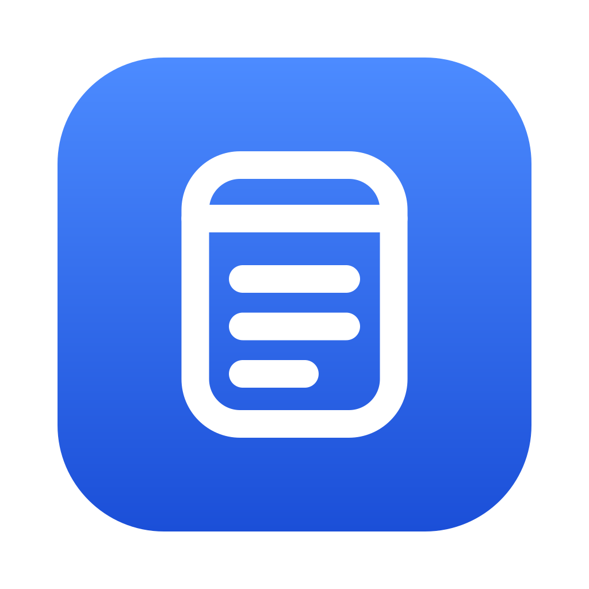
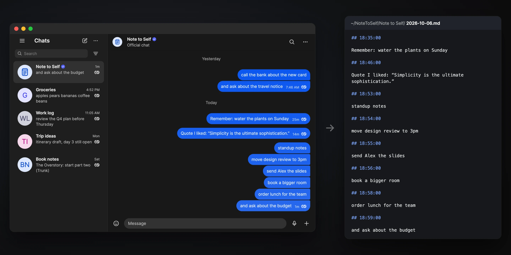

<p align="center"></p>
<h1 align="center">Note to Self</h1>
<p align="center">A chat with yourself, saved as Markdown on your own computer.</p>
<p align="center">
  <a href="https://github.com/human-genomics/note-to-self/actions/workflows/test.yml"></a>
  <a href="LICENSE"></a>
  
  
</p>



Note to Self looks and works like the "Note to Self" chat in Signal Desktop, but it's a small app that runs entirely on your computer: every message you send is saved as a plain Markdown note in a folder you control.

- **Your notes are just files.** One readable `.md` file per day, in a folder per chat. Open them in any editor, search them, back them up, or hand them to an AI.
- **You always know where they are.** Everything the app stores is in one folder, `~/NoteToSelf`. Settings shows it, opens it in your file manager, and can delete it completely.
- **Private.** Nothing is uploaded and there's no account. Websites you visit and other accounts on the same computer can't read your notes.
- **Nothing to set up.** It needs only Python 3.8 or newer: no packages, no build step, no database.

> Not affiliated with or endorsed by Signal Messenger. The look is recreated from scratch; no Signal code or artwork is used.

## Install

**macOS, with [Homebrew](https://brew.sh)**

```sh
brew install human-genomics/tap/note-to-self
notetoself --install-app
```

That puts **Note to Self** in your Applications folder: open it from Launchpad or Spotlight, and drag it to the Dock to keep it there.

**Ubuntu, Debian and other Linux with apt**

Add the Note to Self repository once:

```sh
sudo install -m 0755 -d /etc/apt/keyrings
sudo wget -qO /etc/apt/keyrings/note-to-self.asc https://human-genomics.github.io/note-to-self/note-to-self.asc
echo "deb [signed-by=/etc/apt/keyrings/note-to-self.asc] https://human-genomics.github.io/note-to-self stable main" \
  | sudo tee /etc/apt/sources.list.d/note-to-self.list
```

Then install it, and later get updates with `sudo apt upgrade` like everything else:

```sh
sudo apt update && sudo apt install note-to-self
```

Open **Note to Self** from your applications, or run `notetoself`. (Or install the `.deb` from the [latest release](https://github.com/human-genomics/note-to-self/releases/latest) with `sudo apt install ./note-to-self_all.deb`, without updates.)

**From source** (macOS, Linux, or anywhere with Python 3.8 or newer)

```sh
git clone https://github.com/human-genomics/note-to-self.git
cd note-to-self
./notetoself
```

Python 3 comes with Ubuntu and most Linux systems. On a Mac without Homebrew, macOS offers to install it (with the Command Line Tools) the first time you run `./notetoself`. Run `./notetoself --install-app` to add it to your apps.

**Windows** (best effort): install [Python](https://www.python.org/downloads/), download this repository, and double-click `notetoself.bat`.

### Opening it like any other app

After `notetoself --install-app` (or installing the `.deb`), Note to Self is with your other apps:

- **macOS:** in your Applications folder, Launchpad and Spotlight. Drag it to the Dock to keep it there. It's made on your own Mac, so macOS opens it without any security warnings.
- **Linux:** in your applications menu, where you can pin it to your dock or favorites.

Click it and the window opens. Note to Self keeps running quietly in the background after you close the window, so it opens instantly next time. `notetoself --uninstall-app` takes it out of your apps again (your notes stay).

### Starting and stopping

`notetoself` starts a small server on your computer and opens the app in a window. Running it (or clicking the app) again while it's running just opens another window.

- Started from a terminal, it runs until you press Ctrl+C there.
- Started from your apps, it keeps running in the background until you quit it or log out.
- Either way, **☰ → Quit Note to Self** in the window, or `notetoself --stop`, stops it. Your notes stay where they are.

### Uninstalling

```sh
notetoself --uninstall-app      # first take it out of your apps (the package manager can't)
brew uninstall note-to-self     # or: sudo apt remove note-to-self
```

Uninstalling never deletes your notes: they stay in `~/NoteToSelf`, and reinstalling picks them up again. To delete them as well, use **Settings → Delete all data** before you uninstall (or delete the folder yourself).

### Choosing a browser

Normally Note to Self opens in its own app window, without tabs or an address bar, using Google Chrome, Chromium, Microsoft Edge, Brave or Vivaldi, even if your default browser is something else: only those can show it as an app. If you have none of them, it opens in your default browser (Firefox and Safari work too, in a regular tab).

To pick the browser yourself, open **Settings → Browser** and choose one: it lists the browsers on your computer, and Note to Self opens there from then on (**Open a window there now** switches right away). You can also choose when you start it:

```sh
notetoself --browser firefox           # or chrome, chromium, edge, brave, vivaldi, safari
notetoself --browser default           # your system's default browser
notetoself --browser /path/to/browser  # any other browser
```

Or set `NOTETOSELF_BROWSER` in your shell profile (`~/.zshrc` on macOS, `~/.bashrc` on Linux), for example `export NOTETOSELF_BROWSER=firefox`. `--browser` wins over `NOTETOSELF_BROWSER`, which wins over the Settings choice.

## Your notes

### Where they are

Everything Note to Self stores is in one folder, `~/NoteToSelf` (choose another with `--dir`). Open **Settings** (the ☰ menu, or Cmd/Ctrl+,) to see its full path, open it in your file manager, see what's in it, or delete it.

```
~/NoteToSelf/
├── Note to Self/              one folder per chat
│   ├── 2026-10-04.md          one Markdown file per day
│   ├── 2026-10-06.md
│   ├── .draft.md              what you've typed but not sent yet
│   └── attachments/
│       └── 2026-10-04_194800_sunset.png
├── Groceries/
│   ├── 2026-10-05.md
│   └── 2026-10-06.md
├── Work log/
├── Trip ideas/
├── Book notes/
├── .trash/                    deleted notes, earlier versions of edited notes, a log of sent notes
└── .notetoself.json           marks the folder as Note to Self's; holds its private key
```

### What a note looks like

`Note to Self/2026-10-04.md`, from the same notes as the picture at the top:

```markdown
## 19:48:00


Sunset from the ridge trail

## 21:10:00

lentil soup recipe to try this weekend: https://example.com/recipes/lentil-soup
```

Each note is a `## HH:MM:SS` heading (with ` (edited)` after the time once you've edited it), then any attachments, then your text.

A note gets its ✓✓ only after it has been written and flushed to disk. If saving fails you'll see **Send failed** with a Retry option.

**You can edit these files by hand** in any editor; the app picks up changes within a few seconds. To add a note, append a `## HH:MM:SS` heading, a blank line, and your text.

### The trash and deleting everything

- Deleting a note, editing it, or deleting a chat moves the old version to `.trash/`, in case you need it back. Every sent note is also logged there. **Settings → Empty trash** removes all of it.
- **Settings → Delete all data** asks you to confirm, then permanently deletes the whole folder, trash included, and stops the app. Nothing Note to Self stored is left on your computer. (Backups made by other tools, such as Time Machine or a cloud drive, aren't affected.)
- Uninstalling the app doesn't touch your notes; use Delete all data first if you want them gone.

## Features

- Send notes, with emoji, links, and images or files (＋, paste, or drag and drop)
- Scroll back through your whole history, with date separators
- Search all chats or just this one, and jump to any result
- Edit a note (hover **…** → Edit, or press ↑ in an empty composer)
- Delete one note, or several with **Select** (Shift+click selects a range)
- Multiple chats: create one with ✎, and rename or delete it from its **…** menu
- Unsent drafts are kept per chat
- Show any note, chat, or the whole notes folder in your file manager

### Keyboard shortcuts

| Keys | Action |
|---|---|
| Enter | Send |
| Shift+Enter | New line |
| ↑ (in an empty composer) | Edit your last note |
| Esc | Cancel editing, leave Select mode, or close a menu |
| Cmd/Ctrl+F | Search all chats |
| Cmd/Ctrl+Shift+F | Search this chat |
| Cmd/Ctrl+, | Settings |

## Options

```
notetoself --dir PATH        notes folder (default ~/NoteToSelf)
notetoself --port N          local port (default 6683)
notetoself --browser NAME    which browser to open (see Choosing a browser)
notetoself --no-open         start without opening a window
notetoself --stop            stop the running Note to Self
notetoself --install-app     add it to your apps (macOS: Applications, so it can go in the Dock)
notetoself --uninstall-app   take it out of your apps again
notetoself --version
```

**Start it when you log in**: on macOS, add **Note to Self** to System Settings → General → Login Items; on Ubuntu, add `notetoself --background --no-open` to the Startup Applications app.

**Run it from anywhere** (from source): link it into a folder on your PATH, for example `ln -s "$PWD/notetoself" ~/.local/bin/notetoself`.

**Use it on another computer over SSH**, such as a workstation: connect with `ssh -L 6684:127.0.0.1:6684 workstation`, run `notetoself --port 6684` there, and open the link it prints in your browser.

## Privacy and security

- **It only runs on your computer.** The server listens on 127.0.0.1 only, the page loads nothing from the internet, and there's no account, telemetry or update check.
- **Everything stays in your notes folder.** Notes, attachments, drafts and the trash are files in that folder. Your browser keeps just a cookie that lets it open the app, plus your pane width and recently used emoji.
- **Other people on the same computer can't read your notes.** The folder is created private to your account, and the app only answers a browser holding the folder's key, which `notetoself` passes to the window it opens.
- **Websites can't read your notes.** Requests from other sites are rejected (Host, Sec-Fetch-Site and custom-header checks), the page has a strict Content Security Policy, and attachments are served sandboxed.

See [SECURITY.md](SECURITY.md) for details and how to report a problem.

## FAQ

**Is this Signal?** No. It only borrows the look of Signal's Note to Self chat. Nothing is sent anywhere, and it can't talk to Signal.

**Does it sync between computers?** Not by itself. You can point `--dir` at a synced folder (iCloud Drive, Dropbox, Syncthing), but use the app on one computer at a time: if the sync tool makes conflicting copies such as `2026-10-04 2.md`, Note to Self leaves them alone and tells you, so you can merge them by hand.

**Why does it open in a browser?** That's what makes it work the same on every computer with nothing else to install. In Chrome, Edge, Brave, Vivaldi and Chromium it gets its own window, without tabs or an address bar, so it feels like an app. See [Choosing a browser](#choosing-a-browser) to use another one.

**How do I back up my notes?** Copy the folder. It's plain files.

## Development

No dependencies, no build step. The server is the Python standard library; the interface is plain HTML, CSS and JavaScript modules.

```sh
python3 -m venv .venv
.venv/bin/python -m unittest discover tests     # unit tests
.venv/bin/python tools/seed.py --out demo-notes --profile readme
./notetoself --dir demo-notes --port 6699       # try it with demo notes
```

The end-to-end tests drive the real app in real browsers with [Playwright](https://playwright.dev/python/) (only the tests need it):

```sh
.venv/bin/pip install -r e2e/requirements.txt
.venv/bin/python -m playwright install chromium firefox webkit
.venv/bin/python -m e2e --browser chromium,firefox,webkit
```

Every push runs, in GitHub Actions:
- the unit tests on Linux, macOS and Windows, from Python 3.8 to 3.14;
- the end-to-end tests in Chromium, Firefox and WebKit;
- a build of the `.deb`, installed with `apt` from a signed APT repository, and of the Homebrew formula, installed and tested with `brew`.

Pushing a version tag publishes a release (see [RELEASING.md](RELEASING.md)).

| Path | What it is |
|---|---|
| `notetoself`, `notetoself.bat`, `notetoself.py` | launchers and entry point |
| `nts/grammar.py` | the day-file format (fuzz-tested lossless round trip) |
| `nts/store.py` | chats, notes, drafts, trash, attachments, search, durable writes |
| `nts/server.py` | the local HTTP server and JSON API, with its security checks |
| `nts/launch.py` | command line, single instance, opening the app window |
| `web/` | the interface |
| `tests/` | unit tests |
| `e2e/` | end-to-end tests in real browsers |
| `packaging/linux/` | the app launcher entry and man page for the `.deb` |
| `tools/` | demo notes, a quick browser smoke test, and building the `.deb`, Homebrew formula and release notes |

See [CONTRIBUTING.md](CONTRIBUTING.md) to get involved and [RELEASING.md](RELEASING.md) for publishing a release.

## License

MIT, see [LICENSE](LICENSE). The bundled [Inter](https://rsms.me/inter/) typeface is under the SIL Open Font License (`web/fonts/OFL.txt`).
